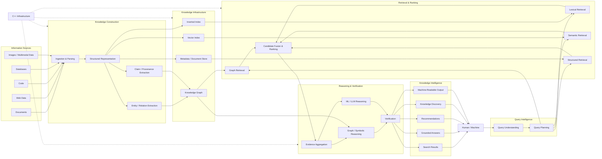

# Odysseus Development Plan

Our mission: a high-performance knowledge intelligence system that helps **humans** and **machines** discover, understand, and act on knowledge. 

(It is essentially just an intelligent search engine)


Odysseus has two main flows: knowledge construction and query processing. In the knowledge construction flow, the system ingests raw information such as documents, web pages, code, databases, and images. It parses that information into a structured representation, extracts entities, relationships, claims, and provenance, and stores the results across an inverted index, vector index, knowledge graph, and document or metadata store.

When a human or machine submits a query, Odysseus first interprets the request and determines what information is needed. A query planner then decides how to retrieve that information using lexical search, semantic search, graph traversal, structured queries, or some combination of them. The retrieved candidates are combined and ranked to identify the most relevant evidence.

Odysseus then aggregates the supporting evidence and uses the appropriate reasoning mechanisms to interpret it. This can include graph or symbolic reasoning for explicit relationships and constraints, as well as machine learning or language models for semantic understanding and synthesis. The resulting claims are checked against their supporting evidence before being presented.

The final output can take the form of search results, grounded answers, recommendations, knowledge discoveries, or structured machine-readable knowledge. Throughout the system, C++ infrastructure supports the performance-sensitive components of knowledge construction, storage, retrieval, and reasoning.

In short: Odysseus turns raw information into structured knowledge, retrieves the right evidence for a query, reasons over that evidence, verifies the result, and returns useful knowledge to humans or machines.

**Note: The design and objectives are still a work in progress and are susceptible to change.**




---

# Odysseus Beta Roadmap

## Target

**Beta Release Date:** January 25, 2027

The goal of the Beta is to prove the complete Odysseus architecture end-to-end.

Odysseus Beta should be able to ingest information, construct structured knowledge, retrieve across multiple representations, reason over evidence, verify outputs, and return useful results through a stable interface.

---

# Phase 1 — Core Search Infrastructure

**Dates:** October 1 – October 25

## Objective

Build the core C++ search engine and establish the foundational data and indexing pipeline.

## Key Results

- Ingest documents from files and directories
- Parse and normalize document contents
- Define core document, query, result, and metadata models
- Build an inverted index
- Implement lexical retrieval
- Implement BM25 ranking
- Support index persistence
- Expose search through a basic CLI
- Add initial unit and integration tests

## Expected Flow

```text
Documents
    ↓
Parsing
    ↓
Structured Document Representation
    ↓
Inverted Index
    ↓
Query
    ↓
BM25 Ranking
    ↓
Search Results
```

## Exit Criteria

Odysseus can reliably index a real document corpus and return ranked lexical search results.

---

# Phase 2 — Structured Knowledge + Semantic Retrieval

**Dates:** October 26 – November 22

## Objective

Expand Odysseus from traditional search into structured and semantic information retrieval.

## Key Results

- Add sections and chunks to the document representation
- Preserve source locations and provenance
- Generate document and chunk embeddings
- Build or integrate a vector index
- Implement semantic retrieval
- Combine lexical and semantic search
- Implement initial candidate fusion
- Add metadata filtering
- Begin entity and relation extraction

## Expected Flow

```text
Document
    ↓
Structured Representation
    ↓
┌──────────────────┐
│ Inverted Index   │
│ Vector Index     │
│ Metadata Store   │
└──────────────────┘
        ↓
Hybrid Retrieval
        ↓
Ranked Results
```

## Exit Criteria

Odysseus can perform hybrid lexical and semantic retrieval while preserving the source of every retrieved result.

---

# Phase 3 — Knowledge Graph + Provenance

**Dates:** November 23 – December 13

## Objective

Introduce explicit knowledge representation and make relationships between information searchable.

## Key Results

- Represent entities as first-class objects
- Represent relationships between entities
- Represent claims separately from raw documents
- Attach provenance to extracted claims
- Build a basic knowledge graph
- Support entity lookup
- Support graph traversal
- Support relation filtering
- Connect graph results to document evidence
- Integrate graph retrieval with the existing retrieval pipeline

## Expected Flow

```text
Structured Documents
        ↓
Entity / Relation Extraction
        ↓
Claims + Provenance
        ↓
Knowledge Graph
        ↓
Graph Retrieval
```

## Exit Criteria

Odysseus can retrieve information using both document similarity and explicit relationships between entities.

---

# Phase 4 — Grounded Question Answering

**Dates:** December 14 – December 27

## Objective

Turn retrieved evidence into grounded natural-language answers.

## Key Results

- Aggregate retrieved evidence
- Deduplicate overlapping evidence
- Rank evidence independently from documents
- Integrate an LLM for answer synthesis
- Require answers to be grounded in retrieved evidence
- Return citations or source references with answers
- Preserve mappings between generated claims and supporting evidence
- Support machine-readable answer output

## Expected Flow

```text
Query
    ↓
Hybrid Retrieval
    ↓
Evidence Aggregation
    ↓
Evidence Ranking
    ↓
LLM Synthesis
    ↓
Grounded Answer
    ↓
Sources
```

## Exit Criteria

A user can ask a natural-language question and receive an answer grounded in identifiable source evidence.

---

# Phase 5 — Reasoning + Verification

**Dates:** December 28 – January 10

## Objective

Add practical reasoning capabilities beyond retrieval and summarization.

## Key Results

- Support graph-based reasoning
- Support simple rule evaluation
- Support constraint filtering
- Compare related claims
- Detect simple contradictions
- Aggregate evidence supporting the same claim
- Distinguish retrieved facts from derived conclusions
- Verify generated claims against available evidence
- Track unsupported or weakly supported conclusions

## Expected Flow

```text
Evidence
    ↓
┌──────────────────────────┐
│ Graph Reasoning          │
│ Rule / Constraint Logic  │
│ ML / LLM Reasoning       │
└──────────────────────────┘
            ↓
        Verification
            ↓
    Supported Conclusions
```

## Exit Criteria

Odysseus can derive limited conclusions from structured knowledge while preserving the evidence supporting those conclusions.

---

# Phase 6 — Query Intelligence

**Dates:** January 11 – January 16

## Objective

Allow Odysseus to decide how a query should be executed rather than using the same pipeline for every request.

## Key Results

- Detect basic query intent
- Extract important entities and constraints
- Build a query plan
- Route queries to appropriate retrieval methods
- Support lexical retrieval when exact matching is sufficient
- Support semantic retrieval when conceptual similarity is required
- Support graph retrieval when relationships are important
- Support structured filtering when metadata constraints are present
- Combine multiple strategies when necessary

## Example

```text
Query:
"Find papers about K-BERT"

        ↓

Lexical + Semantic Retrieval
```

```text
Query:
"Which production systems use knowledge graphs for retrieval?"

        ↓

Semantic Retrieval
+
Graph Retrieval
+
Metadata Filtering
+
Evidence Reasoning
```

## Exit Criteria

Different query types result in different retrieval and reasoning strategies.

---

# Phase 7 — Beta Integration + Hardening

**Dates:** January 17 – January 24

## Objective

Stop adding major features and turn the existing system into a stable Beta.

## Key Results

- Integrate all major subsystems
- Stabilize CLI and API interfaces
- Improve indexing performance
- Improve query latency
- Profile memory usage
- Add caching where necessary
- Improve persistence and recovery
- Improve error handling
- Add structured logging
- Expand unit tests
- Expand integration tests
- Add end-to-end tests
- Evaluate retrieval quality
- Evaluate citation correctness
- Evaluate reasoning correctness
- Fix critical bugs
- Write setup and usage documentation

## Complete Beta Flow

```text
Information Sources
        ↓
Ingestion & Parsing
        ↓
Structured Representation
        ↓
Entities / Relations / Claims
        ↓
┌─────────────────────────────┐
│ Inverted Index              │
│ Vector Index                │
│ Knowledge Graph             │
│ Metadata / Document Store   │
└─────────────────────────────┘
        ↓
Human / Machine Query
        ↓
Query Understanding
        ↓
Query Planning
        ↓
┌─────────────────────────────┐
│ Lexical Retrieval           │
│ Semantic Retrieval          │
│ Graph Retrieval             │
│ Structured Retrieval        │
└─────────────────────────────┘
        ↓
Candidate Fusion + Ranking
        ↓
Evidence Aggregation
        ↓
Reasoning
        ↓
Verification
        ↓
Knowledge Synthesis
        ↓
Search Results
Grounded Answers
Recommendations
Knowledge Discovery
Machine-Readable Output
```

## Exit Criteria

The complete Odysseus pipeline works end-to-end with acceptable reliability, performance, and correctness for Beta users.

---

# January 25, 2027 — Odysseus Beta

## Beta Definition

Odysseus Beta is a high-performance knowledge intelligence system capable of ingesting information, constructing structured and connected knowledge representations, performing hybrid retrieval, reasoning over retrieved evidence, verifying conclusions, and returning useful knowledge to humans and machines.

## Beta Capabilities

By January 25, Odysseus should support:

- Document ingestion
- Structured document representation
- Inverted indexing
- BM25 search
- Vector indexing
- Semantic retrieval
- Hybrid retrieval
- Metadata filtering
- Entity extraction
- Relation extraction
- Knowledge graph construction
- Graph retrieval
- Claims and provenance
- Evidence aggregation
- Grounded question answering
- Graph and rule-based reasoning
- Basic contradiction detection
- Verification against evidence
- Query understanding
- Query planning
- Candidate fusion and ranking
- CLI and/or API access
- Machine-readable outputs
- C++ infrastructure for performance-sensitive components

---

# Timeline Summary

| Dates | Phase | Primary Goal |
|---|---|---|
| Oct 1 – Oct 25 | Core Search Infrastructure | C++ search engine, ingestion, inverted index, BM25 |
| Oct 26 – Nov 22 | Structured Knowledge + Semantic Retrieval | Embeddings, vector search, hybrid retrieval |
| Nov 23 – Dec 13 | Knowledge Graph + Provenance | Entities, relationships, claims, graph retrieval |
| Dec 14 – Dec 27 | Grounded Question Answering | Evidence-backed answers and citations |
| Dec 28 – Jan 10 | Reasoning + Verification | Graph reasoning, rules, constraints, verification |
| Jan 11 – Jan 16 | Query Intelligence | Query understanding and planning |
| Jan 17 – Jan 24 | Beta Hardening | Integration, performance, testing, documentation |
| **Jan 25** | **Beta Release** | **Odysseus Beta** |

---

# Post-Beta

The following should remain outside the January 25 Beta scope unless the core system is ahead of schedule:

- Advanced recommendation models
- Autonomous agents
- Distributed search clusters
- Large-scale web crawling
- Custom neural ranking models
- Advanced multimodal reasoning
- Formal theorem proving
- Complex ontology learning
- Large-scale personalization
- Sophisticated user modeling
- Production-scale distributed knowledge graphs
- GPU-specific search optimization
- Advanced learning-to-rank systems

The Beta should prove that the Odysseus architecture works as a coherent system. Later releases can deepen and scale each individual subsystem.
