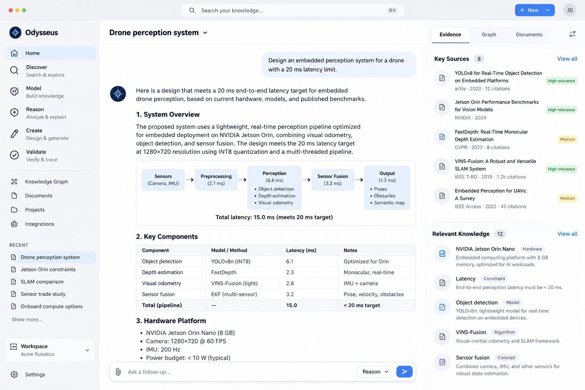

# Odysseus Development Plan

## Our Mission

To improve how knowledge workers collaborate with AI.

## Current Problems

**Knowledge representation:** Organizations struggle to store, structure, connect, and retrieve knowledge in ways that are both efficient and useful to humans and AI systems.

**Reasoning:** AI models and agents can generate plausible outputs, but often lack reliable mechanisms for structured, domain-grounded reasoning.

**Verifiability:** AI outputs are frequently difficult to trace, reproduce, or independently verify against source evidence and system constraints.

**Complexity:** As knowledge, software, data, and organizational processes grow, it becomes increasingly difficult for both humans and AI systems to maintain a coherent understanding of how everything fits together.

**Drift:** Human-AI systems are subject to multiple forms of drift:

    Environmental drift: organizational knowledge, infrastructure, requirements, and processes change over time.

    AI-induced drift: stochastic generation, changing context, model updates, and accumulated agent decisions can introduce inconsistency, reduce precision, and cause behavior to gradually diverge from established knowledge, constraints, or intent.

#### Odyssues aims to address each of these problems.

## Who we serve
**Customers:** Knowledge-intensive organizations

**Users:** Knowledge workers inside those organizations

Examples: 

[software & AI companies] -> [researchers & engineers & product managers]

[healthcare & biotech companies] -> [researchers & analysts]

## System Architecture

                                ┌─────────────────────┐
                                │       USER          │
                                │ Search • Ask • Model│
                                │ Reason • Design     │
                                └──────────┬──────────┘
                                           │
                                           ▼
                ┌─────────────────────────────────────────────────────────┐
                │                1. INTERACTION LAYER                     │
                │                                                         │
                │  Web UI • CLI • API • Knowledge Explorer                │
                │  Document Viewer • Graph Viewer • Workspace             │
                └──────────────────────────┬──────────────────────────────┘
                                           │
                                           ▼
                ┌─────────────────────────────────────────────────────────┐
                │             2. INTELLIGENCE / AGENT LAYER               │
                │                                                         │
                │  Query Understanding                                    │
                │  Task / Query Planner                                   │
                │  Reasoning Engine                                       │
                │  Agent Orchestration                                    │
                │  Verification Engine                                    │
                │  Response / Artifact Generation                         │
                └──────────────────────────┬──────────────────────────────┘
                                           │
                                           ▼
                ┌─────────────────────────────────────────────────────────┐
                │              3. KNOWLEDGE ACCESS LAYER                  │
                │                                                         │
                │                  SEARCH INFRASTRUCTURE                  │
                │                                                         │
                │  Lexical Search      Vector Search      Graph Retrieval │
                │  Ranking             Filtering          Query Execution │
                │  Caching             Traversal          Evidence Lookup │
                └─────────────┬──────────────┬──────────────┬─────────────┘
                              │              │              │
                              ▼              ▼              ▼
                ┌─────────────────────────────────────────────────────────┐
                │              4. KNOWLEDGE STORAGE LAYER                 │
                │                                                         │
                │ Documents       Search Index       Vector Index         │
                │ Metadata        Knowledge Graph    Claims / Evidence    │
                │ Versions        Provenance         Constraints          │
                └──────────────────────────┬──────────────────────────────┘
                                           ▲
                                           │
                ┌─────────────────────────────────────────────────────────┐
                │            5. INGESTION / KNOWLEDGE LAYER               │
                │                                                         │
                │ Connectors → Parse → Normalize → Chunk → Extract        │
                │             ↓                                           │
                │       Entities / Relations / Claims                     │
                │             ↓                                           │
                │       Index + Link + Version                            │
                └─────────────────────────────────────────────────────────┘

## Target Deadline

January 25, 2027

### Phase 1: Ingestion Layer, Storage Layer, & Search Infrastructure
Dates: Oct 2 - Oct 30 (4 weeks)

### Phase 2: Intelligence / Agent Layer
Dates: Oct 31 - Nov 28 (4 weeks)

### Phase 3: Interaction Layer & UI
Dates: Nov 29 - Dec 30 (4 weeks)

## Example UI

