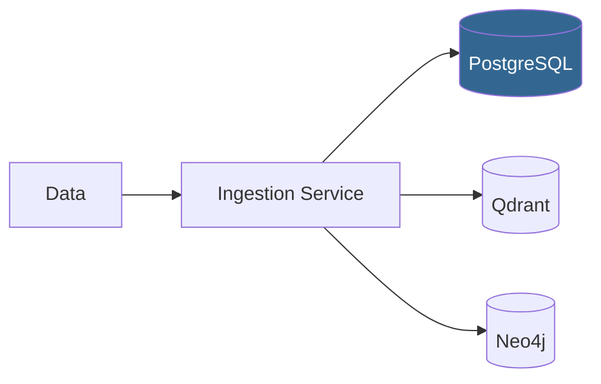

## Ingestion Service

The objective of this service is to process user data and update associated databases.

### How does ingestion work



(We have currently only integrated **PostgreSQL**)

When a user references a datasource such a `github repo` or `document corpus`


### How do we populate associated databases 

### How to use it

Build dependencies: C11/C++17 compilers, CMake 3.18+, nlohmann_json 3.11+,
PostgreSQL libpq, and libcurl. The first CMake configure downloads SHA-256-pinned
Tree-sitter 0.25.10, tree-sitter-c 0.24.1, and tree-sitter-cpp 0.23.4 sources.
Their generated parsers are compiled locally; no Node, Rust, or Tree-sitter CLI
installation is required. Later builds reuse the downloaded sources in `build/`.

```sh
cmake -S ingestion -B build/ingestion
cmake --build build/ingestion --parallel
ctest --test-dir build/ingestion --output-on-failure
./build/ingestion/odysseus ingest github https://github.com/OWNER/REPO
./build/ingestion/odysseus ingest github https://github.com/OWNER/REPO --ref main
```

`--ref` accepts a branch, tag, or commit; omission selects the default branch.
The client resolves the revision to a commit before listing and fetching blobs.
Set `GITHUB_TOKEN` in the environment for private repositories or authenticated
rate limits; it needs read access to repository contents. Tokens and API error
bodies are not printed. Add `--postgres` with `ODYSSEUS_DATABASE_URL` configured
to persist results; otherwise they print.

Use `--mock` with `https://github.com/example/mock-repo` for the built-in fixture
without HTTP requests. `--mock` and `--ref` cannot be combined.

Supported extensions are `.c`, `.h`, `.cpp`, `.cc`, `.cxx`, `.hpp`, `.md`, and
`.txt`. Other file paths are counted as skipped without downloading their blobs.
Symlinks and submodules are not followed or counted. Supported content must be
UTF-8; binary content and processing/storage failures stop ingestion.

Current retrieval limits: github.com HTTPS URLs only; truncated tree listings
fail explicitly; moved repositories require their current URL; HTTP errors and
rate limits fail without automatic retries. Empty GitHub repositories report an
error. Supported files are limited to 8 MiB, HTTP responses to 16 MiB, and total
fetched text to 64 MiB. Retrieval is sequential and materializes a snapshot before
processing. Git LFS objects are not downloaded; pointer files remain ordinary
contents. `.git` suffixes and trailing slashes are accepted.


## Code extraction contract (v2)

`CodeExtractor` uses Tree-sitter's C grammar for `.c`, and C++ for the other
supported code extensions (including ambiguous `.h` headers). Direct callers can
explicitly select `CodeLanguage::C` or `CodeLanguage::Cpp`.

Code models retain the existing includes/classes/functions/calls arrays and add:

- `schema_version: 2` and parser runtime, grammar, and extraction-rule versions.
- `parse_status: complete|partial` with error, missing-syntax, or unsupported
  extraction diagnostics. Partial results are retained, not rejected as binary.
- Exact original UTF-8 source spans: zero-based bytes with exclusive end,
  one-based inclusive lines. Definition spans cover the full definition, not
  just its name. Multiline signature spelling is retained.
- File-local occurrence IDs and lexical ownership for namespaces, classes,
  functions, lambdas, blocks, and call sites. Consumers must qualify these IDs
  by artifact and extraction version; they are not stable across source edits.
- Unresolved call sites with full callee expression, display spelling, caller
  occurrence ID, and source span. These are syntax observations, not proven
  runtime calls. Global-initializer sites can have no caller function.

Only definitions with bodies are listed as functions/classes. Prototypes,
forward declarations, and deleted/defaulted methods are not definition records.
Unsupported function declarators (such as conversion operators) produce an
explicit partial-extraction diagnostic. `return_type` retains the declaration
prefix spelling for compatibility, not a compiler-resolved type; the full
`signature` is authoritative for complex declarators or trailing return types.
`owner_id` is lexical ownership; an out-of-line method's class membership still
requires semantic resolution.

No preprocessor evaluation, macro expansion, type checking, overload resolution,
or cross-file resolution is performed. Conditional branches can both appear in
the extracted syntax. A complete parse means syntactic extraction succeeded,
not that the program compiles or every referenced symbol is understood.

PostgreSQL stores these fields in the existing model JSONB column and task
payloads; no destructive SQL migration is needed. Legacy model JSON remains
readable as version 1 with unknown parser provenance. Re-ingest an existing repo
to produce v2 models: changed model payloads requeue indexing at a new generation.

New graph projections use occurrence IDs so overloads and same-named classes do
not collide. Calls become `OdysseusCallSite` nodes linked by `HAS_CALL_SITE` from
their caller and `CONTAINS` from their file. They do not create guessed callee
functions or `CALLS` edges. To visualize new call sites:

```cypher
MATCH p=(:OdysseusFunction)-[:HAS_CALL_SITE]->(:OdysseusCallSite)
RETURN p LIMIT 100;
```

Legacy queued models retain the old projection behavior; old generations and
their `CALLS` edges remain stored. This change does not migrate/delete historical
graphs, add a resolver, or implement the target release-publication schema.
Unfiltered graph exploration can therefore still show legacy inferred targets.

Offline builds can supply matching unpacked upstream sources through CMake's
`FETCHCONTENT_SOURCE_DIR_ODYSSEUS_TS_RUNTIME`,
`FETCHCONTENT_SOURCE_DIR_ODYSSEUS_TS_C_SOURCE`, and
`FETCHCONTENT_SOURCE_DIR_ODYSSEUS_TS_CPP_SOURCE` options. Overrides bypass archive
hash verification: use exactly the documented versions for accurate provenance.

Upstream sources and licenses:
[runtime](https://github.com/tree-sitter/tree-sitter/tree/v0.25.10),
[C grammar](https://github.com/tree-sitter/tree-sitter-c/tree/v0.24.1),
[C++ grammar](https://github.com/tree-sitter/tree-sitter-cpp/tree/v0.23.4).


## Source adapter registration

`AdapterFactory` maps source types to adapter creator functions. Application setup
registers GitHub with its client; the factory and pipeline do not depend on a
GitHub client. Each creator must return a fresh adapter, and captured dependencies
must outlive both the factory and its adapters. Duplicate registrations, empty
creators, and null adapter results are rejected.

Local files/directories, object storage, and databases are future source extension
points, not implemented adapters. Only GitHub is registered today.

## PostgreSQL verification

The deterministic storage test verifies upserts, Unicode/empty content, structured
models, rollback of new and updated artifacts, and recovery after a failed write.
The opt-in live test fetches `octocat/Spoon-Knife`, pins its commit, ingests it twice,
and compares database content and provenance with the fetched snapshot.

Use separate, newly created test databases, not your normal ingestion database:

```sh
createdb odysseus_storage_test
createdb odysseus_github_test
ODYSSEUS_TEST_DATABASE_URL='dbname=odysseus_storage_test' \
ODYSSEUS_GITHUB_TEST_DATABASE_URL='dbname=odysseus_github_test' \
  ctest --test-dir build/ingestion --output-on-failure
```

Both tests refuse a database that already contains the ingestion schema and leave
records available for inspection. Use fresh databases for subsequent runs. With
no corresponding environment variable, each integration test is skipped. Only
the live test requires GitHub network access; `GITHUB_TOKEN` is optional.

## Vector and graph indexing

PostgreSQL ingestion now saves two durable tasks per artifact in the same
transaction: `vector` and `graph`. Repeat ingestion with unchanged content/model
keeps existing task status. Changed input increments the task generation and
requeues both targets. Workers claim tasks with a lease; failed tasks become
eligible after 60 seconds, and expired leases can be reclaimed after a crash.
The current retry policy has no attempt limit. Queue creation is additive for
existing databases; re-ingest existing artifacts to enqueue their projections.

Start the local development services (Docker required):

```sh
docker compose -f ingestion/compose.indexing.yml up -d
docker compose -f ingestion/compose.indexing.yml exec ollama ollama pull nomic-embed-text
```

The Compose stack uses dedicated volumes and localhost-only ports: Qdrant on
16333, Neo4j HTTP on 17474, and Ollama on 11435. Neo4j authentication is disabled
in this local development stack; do not expose it publicly.

After ingestion with `--postgres`, run:

```sh
./build/ingestion/odysseus-index all
# Or process one destination:
./build/ingestion/odysseus-index vector
./build/ingestion/odysseus-index graph
```

The command reads `ODYSSEUS_DATABASE_URL`, processes up to 100 ready tasks per
target, then exits. Run it again to drain more tasks or retry failures. A backend
failure stops that target for this invocation but does not stop the other target.
There is no continuously running scheduler yet.

Vector tasks split nonempty text into UTF-8-safe chunks of at most 1200 bytes,
request local Ollama embeddings, and upsert them into the Qdrant collection
`odysseus_nomic_v1`. Empty files complete without vectors. The default embedding
model is `nomic-embed-text`, using its `search_document: ` prefix; use the matching
`search_query: ` prefix for future search queries. This is basic size-based
chunking, not syntax-aware chunking.

Graph tasks merge repository, revision, and file nodes connected by
`HAS_REVISION` and `CONTAINS`, plus extracted class/function definitions and v2
unresolved call sites as described above. Document entities and resolved semantic
relationships remain future work. Constraints prevent duplicate nodes on retry.

Configuration overrides:

- `QDRANT_URL`, `QDRANT_COLLECTION`, `QDRANT_API_KEY`
- `OLLAMA_URL`, `ODYSSEUS_EMBEDDING_MODEL`
- `NEO4J_URL` (HTTP endpoint), `NEO4J_DATABASE`, `NEO4J_USER`, `NEO4J_PASSWORD`

Keep one embedding model per collection. Changing a model requires a separate
collection and explicit reindexing; switching environment variables does not
reset completed tasks. Automatic model migrations are not implemented.

Projections use task ID + generation as stable keys. Retrying the same generation
is idempotent. Older generations are retained, so a delayed worker cannot overwrite
a newer generation. Consumers must select the generation recorded as completed
in PostgreSQL; raw database searches may include partial or old generations.
Automatic cleanup and a query layer that enforces this are future work.

Inspect progress without exposing artifact contents:

```sql
SELECT target, status, count(*)
FROM odysseus_ingestion.indexing_tasks
GROUP BY target, status ORDER BY target, status;
```

Workers renew leases during processing and reject completion by expired or
replaced claims. Delivery is at least once, not an atomic transaction across all
three databases. Stored error messages are generic to avoid persisting credentials
or source data from backend diagnostics.

To stop the local services while retaining data:

```sh
docker compose -f ingestion/compose.indexing.yml stop
```

API references: [Qdrant REST](https://api.qdrant.tech/),
[Neo4j Query API](https://neo4j.com/docs/query-api/current/query/), and
[Ollama embeddings](https://docs.ollama.com/api/embed).
Use a separate Qdrant collection and Neo4j database for each PostgreSQL ingestion
database, since task identifiers are local to that database.
